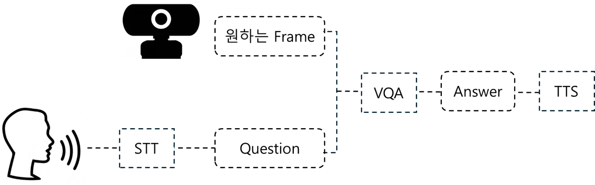

# 시각 장애인을 위한 음성 기반 이미지 질문 응답 시스템

이 프로젝트는 시각 장애인을 위한 음성 기반 이미지 질문 응답 시스템을 개발하는 것을 목표로 합니다. 사용자가 이미지에 대해 질문을 하면, 시스템은 음성을 통해 답변을 제공합니다.

## 시스템 개요

시스템은 사용자의 음성 질문을 받아 이미지를 분석하고, 해당 이미지에 대한 답변을 음성으로 제공합니다. 이 과정은 STT(Speech-to-Text) 모델, VQA(Visual Question Answering) 모델, 그리고 TTS(Text-to-Speech) 모델을 통해 이루어집니다.

## 데이터셋

본 프로젝트는 다음의 데이터셋을 사용합니다:
- AI Hub의 '시각장애인 VQA 데이터셋'
- 데이콘에서 제공하는 '이미지 기반 질의 응답 AI 경진대회' 월간 데이콘 데이터셋

이 데이터셋들은 모델 훈련에 사용되어 시스템의 정확성과 효율성을 높입니다.

## 모델 구성

### STT 모델
STT(Speech-to-Text) 모델은 사용자의 음성 질문을 텍스트로 변환합니다. 
사용 모델: Google Speech Recognition API 

### VQA 모델
VQA(Visual Question Answering) 모델은 이미지와 관련된 질문을 받아 이미지를 분석하고 적절한 답변을 생성합니다.
사용 모델: EfficientNet + Gpt-2

### TTS 모델
TTS(Text-to-Speech) 모델은 시스템이 생성한 텍스트 답변을 음성으로 변환합니다. 이를 통해 시각 장애인 사용자는 음성으로 답변을 들을 수 있습니다.
사용 모델: SpeechT5

## 데모 결과

(여기에 데모 비디오 링크나 결과 이미지를 포함하세요.)

이 프로젝트는 시각 장애인의 일상 생활에서의 독립성을 향상시키는 데 기여하고자 합니다. 사용자의 피드백과 기여는 항상 환영합니다.

---

# 프로젝트 설치 방법

이 프로젝트를 실행하기 전에, 필요한 모든 라이브러리를 설치해야 합니다. 먼저, 이 리포지토리를 클론하거나 다운로드하세요. 그 후, 다음 명령어를 사용하여 필요한 Python 패키지들을 설치합니다:

`pip install -r requirements.txt`

## 모델 로드 방법

`model` 폴더에 훈련된 모델 파일 `model.pth`가 포함되어 있습니다. 
